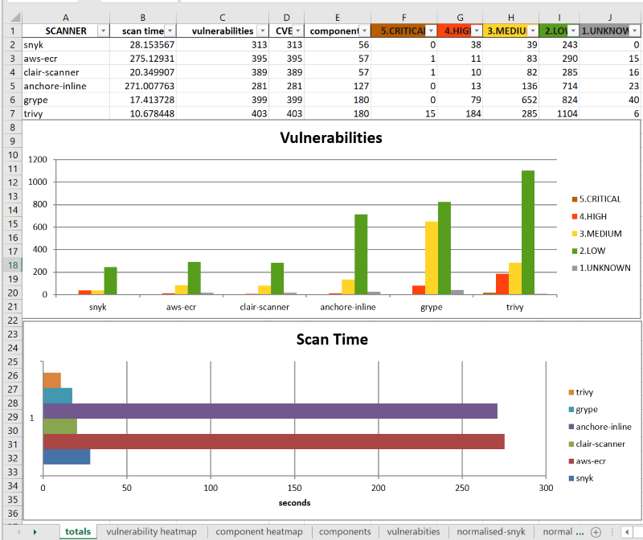
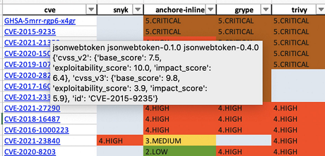
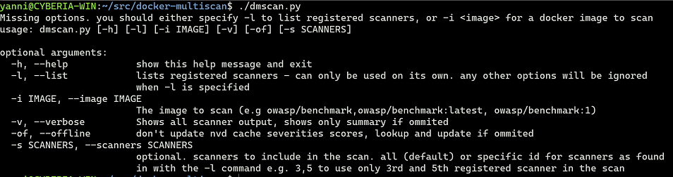
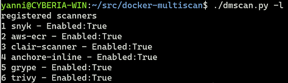
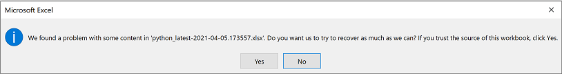
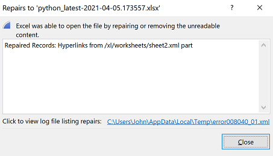

# dmscan - docker-multi-scan 
A multi-scanner utility for docker images. drives Clair, Anchore, Trivy, Snyk, Grype, AWS ECR push on scan. The scanners produce varying results, sometimes hit and miss and dmscan helps you review the results easily and decide how to address them.

*dmscan* run the scans for all register scanners and  then consolidates the results and generates an excel spreadsheet report to help you better understand the results. The spreadsheet contains:

- **Summary tables and charts** by scanner and severity with scanning times, and unique vulnerabilities and CVEs. For non-CVE vulnerabilities, dmscan will do an internet look up to find the referenced CVEs which uses to consolidate results. If non-cve is found the original identifier (eg NWG-XYZ) is kept.



- A **Vulnerability and Component Heatmap** which allows you to see at a glance what has been found and what has been ignored. Vulnerabilities have clickable urls to the security advisories and you can hover on the url to see the description and packages affected.



- **Vulnerability and Component totals** for each scanner

- **"Normalised results"** with the same column headers, severities mapped to use the same rates. The mapping is configurable and the default mapping 1) groups Informational, and Negligible with Low and 3) Adds a number to make sorting easier. Normalised results have autofilter on by default and conditional formatting to colour code severities.   
  
- **Original results**, generated by the scanners

# Setup #

## Prerequisites ##
_dmscan_ requires 
1. Linux/MacOS shell  
2. Docker CLI
3. Python 3.7 or later
4. AWS CLI v2, only if you are going to include AWS ECR scans. In that case you will need to setup your AWS CL2 with a valid Access & Secret key for an account with ECR push and repo creation rights  
5. A snyk account and token, if you are going to include snyk in the scans

if you don't want to use AWS or Snyk then skip their pre-reqs and once the dmscan is isntalled, change the scanners.yml file to disable these two scanners. for more information see [here](#customising-dmscan)

##### It has been used/tested on #### 
- Ubuntu 18 and 20
- MacOS
- EC2 Linux on AWS
- WSL2 on Windows 10 pro

## Installing the scanners
You can manually install the scanners or clone this repository from github and **use the ./install-scanners.sh to install them in one go**:
Make the script executable and then run it 
```
 ./install-scanners.sh 
```

The script should already have execution permissions. If not, or you receive an permission denied error, give it execution permissions with
```
chmod +x install-scanners.sh 
```
 

Once they are installed, you need to  logon to snyk.io and find your token (under settings) then create an environment variable in your profile file (~/.profile, ~/.zprofile etc) as
```
export SNYK_TOKEN=<your snyk token>
```
## Installing dmscan
Install the python packages required by running from the command line and in the project's directory (eg docker-multiscan) run 
```
pip install -r requirements.txt  
```

or if your system uses pip3  as the version of pip for python 3
```
pip3 install -r requirements.txt
```
(you can find out if your pip is for Python 2.x or 3.x with pip --version)


## Using dmscan
You can run dmscan using 
```
python ./dmscan.py
```

or run it as a script 
```
./dmscan.py
```

To run it as a script, Mac users should make sure they have /usr/local/bin/python entry by symlinking python3 eg 
```
ln -s /usr/local/bin/python3  /usr/local/bin/python
```

dmscan.py should already have exectuble permissions, but if you get a permission denied error, give it (and the dependendent scripts) execution permissions with 

```
chmod +x *.sh   
chmod +x dmscan.py   
```

Because of the dependencies on other included shell scripts, you should only run dmscan under the projects directory.


Running it with any parameters it will show the same as screen as if you run it with -h or --help parameter



You can list the registered scanners (in scanners.yml) by running 
./dmscan.py -l



### Running a multiscan
To run  a full  multiscan you need to use 
```
./dmscan.py -i <image name>
```
where image name can include the image tag eg my/image:7.0.1 
If you don't specify tag latest will be assumed, and the image name will be reported as my/image:latest

dmscan will display statistics and create a spreadsheet report under the output subdirectory (which it will create if it does not exist). The spreadhseet name will contain a timestamp so that you have all the scan results, rather than overwriting them.

Normally dmscan suprsesses the output of each scanner. If you want to see detailed output run it as
```
./dmscan.py -i <image name> -v 
```
where -v is verbose mode.

dmscan maintains a sql lite database with a cache of all the cve records from NVDs NIST which is used primarily for CSVS ratings. If you  are not interested in these severity ratings, or you are off line you can disable this feature by running dmscan as
```
./dmscan.py -i <image name> -of
```
Sometimes you'd want to run a quick scan for a subset of registered scanners. Instead of modifying the scanners.yml file, you pass the -s or --scanners command line parameter
This is a comma delimited list of ids for  scanners to include. The numbers can be found when running ./dmscanner.py -l 

For instance if you only wanted to run a scan for snyk, grype, and trivy you'd run
```
./dmscan.py -i <image name> -s 1,5,6
```
Invalid scanner ids will be ignored and a warning will be displayed.

All options except -l and -h can be combined. e.g.
```
./dmscan.py -i <image name> -s 1,5,6 -v -of
```

### Customising dmscan
scanners.yml is the configuration file driving dmscan and you can customise the following:
1. **disable a scanner** (e.g. if you don't use AWS ECR). you can do that by entering under the scanner name
 enabled:
  False
You can re-enable a scanner by changing False to True or completely remove the enabled entry.
2. **change the level of logging** (*debug, info, warn, error, critical*)
3. **change the severity mappings** of each scanner to a common list
4. **customize the configuration of a scanner** under plugins. each scanner has its own plugin section
5. **define a new scanner** 

## Known issues
1. Currently, when you first open the generated spreadsheet, excel prompts you to repair the workbook. 
2. Error handling needs improvement.

Issue #1 relates to the generated Urls, and the issue is being investigated. Until a fix is submitted, just say yes  



The repair is done  and a confirmation of the repair is shown



Save the repaired workbook.


## Where can I get help?
Raise and issue in GitHub

## Can I contribute a fix or improvement?
dmscan belongs to those who use it and want it improved and you can always contribute fixes or improvements using  pull requests.

(c) John Sotiropoulos 2021. This software is licenced under Apache License 2.0 and is distributed on an "AS IS" BASIS, WITHOUT WARRANTIES OR CONDITIONS OF ANY KIND, either express or implied. The full license notice can be found in the LICENSE file. 
